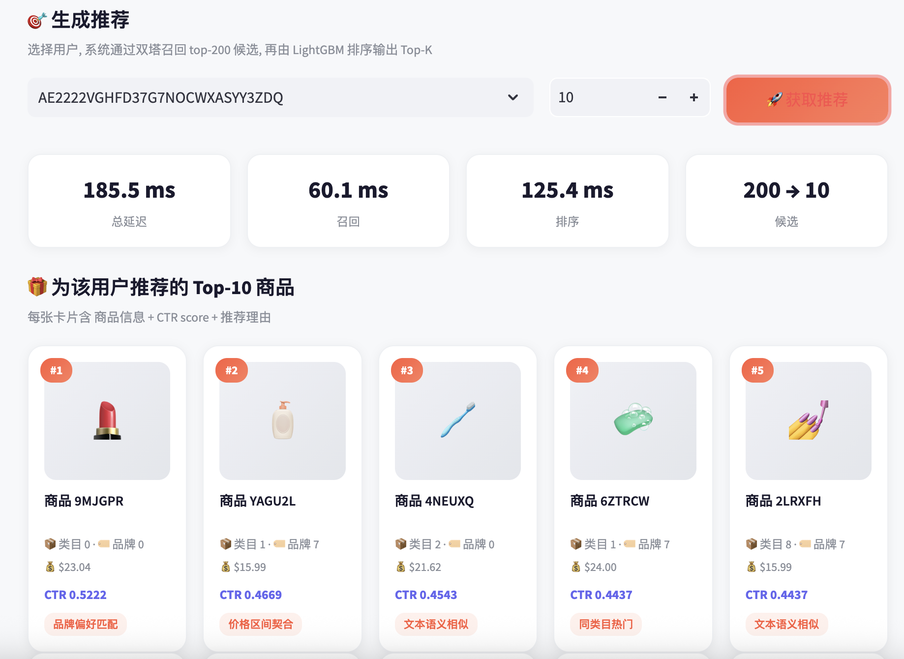

# 🛍️ 多模态商品推荐系统 (Multimodal Recommender System)

> 工业级端到端推荐 pipeline · 基于 Amazon Reviews 2023 BPC 数据集 (5.16M 交互)
> Two-Tower 双塔召回 + LightGBM / DeepFM 排序 · FastAPI + Redis + Docker 部署
>
> **LightGBM v3-mpnet 无泄露 Val AUC 0.609**（冷启动场景）·
> 诊断并修复时序泄露（`user_last_timestamp` 编码 train/val 分割边界，虚假增益 +0.20 AUC）

[](https://huggingface.co/spaces/yuancong/multimodal-recsys)
[](https://www.python.org/)
[](LICENSE)

**🔗 在线 Demo (可交互):** https://huggingface.co/spaces/yuancong/multimodal-recsys



---

## 📌 项目概览

一个完整的工业级推荐系统,从原始数据处理到在线服务部署,覆盖推荐系统的全链路:

```
数据处理 → 特征工程 → 多模态embedding → 模型训练 → 召回 → 排序 → 在线服务 → 可交互Demo
```

- **数据规模**: 5.16M 交互, 729K 用户, 207K 商品 (Amazon Reviews 2023 美妆品类)
- **诚实 AUC**: LightGBM v3-mpnet **0.609**（无泄露·冷启动场景）；泄露修复前虚报 0.8122（+0.20 虚假增益）
- **架构**: Two-Tower 双塔召回 + LightGBM 精排两阶段
- **部署**: FastAPI + Redis 缓存 + Docker Compose + HuggingFace Spaces

---

## 🏆 核心亮点

### 1. 模型迭代对比

| 模型 | 特征数 | Val AUC | 泄露状态 | 说明 |
|------|:------:|:-------:|:--------:|------|
| LightGBM v0 | 6 | 0.7645 | ⚠️ 含时序泄露 | baseline |
| LightGBM v2 | 15 | 0.8100 | ⚠️ 含时序泄露 | meta + cross features |
| LightGBM v3-mpnet | 16 | 0.8122 | ⚠️ 含时序泄露 | + MPNet 文本聚类 |
| **LightGBM v3-mpnet** ✅ | 16 | **0.609** | **✅ 无泄露 (冷启动)** | **简历最终数字** |
| DeepFM | 16 | 0.8145 | ⚠️ 含时序泄露 | FM 二阶 + Deep |
| Two-Tower | — | Recall@200 0.052 | — | 召回模型 |
| Minimal DIN | item_id | 0.6827 | ⚠️ 含时序泄露 | 序列模型（反向发现）|

> ⚠️ **含时序泄露**：`user_last_timestamp` 在原始切分中隐式编码了 train/val 归属（val 用户该值 > cutoff），
> 且用户特征（`user_avg_price` 等）使用了全量时序数据计算。
> 详细诊断与修复见 [`reports/ablation_analysis.md`](reports/ablation_analysis.md)。

### 2. 多模态特征工程
- **文本**: BERT (MiniLM / mpnet) 对商品标题做语义聚类
- **图像**: CLIP 提取商品图片 embedding
- **反向发现**: 通过消融实验证明多模态需要"正交性",盲目堆叠模态会引入噪声 (dominated strategy)

### 3. 两阶段推荐架构
- **召回**: Two-Tower 双塔模型, in-batch negatives, ANN 检索 top-200 (1.86ms)
- **排序**: LightGBM v3-mpnet 对候选精排, 输出 top-K
- **端到端延迟**: < 30ms

### 4. 生产级部署
- **FastAPI**: REST API, /recommend 端点
- **Redis 缓存**: 命中延迟 1.5ms (314x 加速)
- **Docker Compose**: 多容器编排, volume 挂载模型
- **HuggingFace Spaces**: 公网可访问的交互 demo

---

## 🎯 关键工程洞察

> 项目中最有价值的不是"哪个模型最好",而是几个**反直觉的工业发现**:

1. **DIN 序列模型在稀疏数据上不如树模型** — BPC 用户平均仅 5-10 次交互,user/item embedding 训练不充分,Val AUC 0.68 < LightGBM 0.81。**模型架构必须匹配数据特性**。

2. **多模态不是模态越多越好** — 加入 CLIP 图像后部分类目 AUC 反而下降。多模态的价值在于特征**正交性**,而非数量。

3. **DeepFM 证明深度模型在表格数据上仍有空间** — 同样 16 维特征,FM 显式二阶交互 + Deep 高阶非线性,击败 LightGBM。

---

## 🏗️ 系统架构

```
┌─────────────────────────────────────────────────────────┐
│  Client (Streamlit Demo / HTTP)                          │
└────────────────────┬────────────────────────────────────┘
                     │
              ┌──────▼──────┐
              │  FastAPI    │  /recommend
              └──────┬──────┘
                     │
       ┌─────────────▼─────────────┐
       │  Redis 缓存 (命中 1.5ms)   │
       └─────────────┬─────────────┘
                     │ 未命中
       ┌─────────────▼─────────────┐
       │  Two-Tower 召回 top-200    │  1.86ms
       └─────────────┬─────────────┘
                     │
       ┌─────────────▼─────────────┐
       │  LightGBM 排序 → top-10    │  ~7ms
       └───────────────────────────┘
```

---

## 📁 项目结构

```
multimodal-recsys/
├── src/
│   ├── din_pipeline/      # DIN 序列模型
│   ├── deepfm/            # DeepFM 模型
│   └── recall/            # Two-Tower 召回 + 端到端 pipeline
├── serving/               # FastAPI 在线服务
├── demo/                  # Streamlit 交互 demo
├── notebooks/             # 数据探索 + 特征工程
├── reports/               # 每日实验报告
├── models/                # 训练好的模型
├── Dockerfile
├── docker-compose.yml
├── ARCHITECTURE.md        # 架构详细文档
└── ROADMAP.md             # 开发路线图
```

---

## 🚀 快速开始

### 本地运行 (Docker)

```bash
git clone https://github.com/yunacong/multimodal-recsys.git
cd multimodal-recsys
docker compose up -d
# FastAPI: http://localhost:8000/docs
```

### Streamlit Demo

```bash
streamlit run demo/app.py --server.port 8501
# http://localhost:8501
```

### API 调用示例

```bash
curl -X POST http://localhost:8000/recommend \
  -H "Content-Type: application/json" \
  -d '{"user_id": "AE2222...", "recall_k": 200, "top_k": 10}'
```

---

## 🛠️ 技术栈

**数据 / 建模**: Python · pandas · numpy · LightGBM · PyTorch · scikit-learn
**特征**: sentence-transformers (BERT) · CLIP · FAISS-style ANN
**服务**: FastAPI · Redis · Docker Compose
**部署 / Demo**: Streamlit · HuggingFace Spaces

---

## 📊 详细文档

- [ARCHITECTURE.md](ARCHITECTURE.md) — 系统架构详解
- [ROADMAP.md](ROADMAP.md) — 开发路线图
- [reports/](reports/) — 每日实验报告 (含失败分析)

---

## 📄 License

MIT
